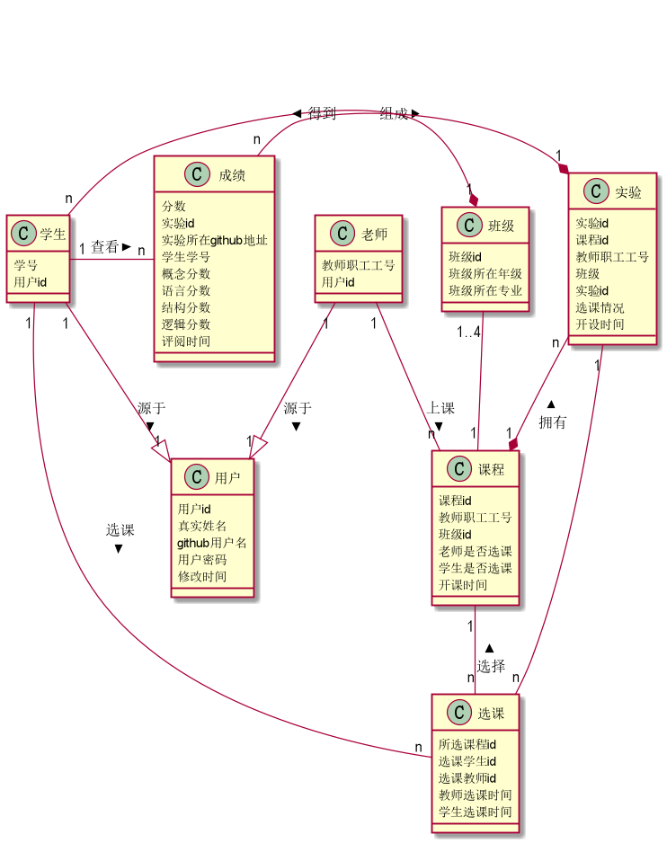

# 实验6：基于GitHub的实验管理平台的分析与设计

## 成都大学信息科学与工程学院
|年级|专业|班级|姓名|学号|
|:-------:|:-------------: | :----------:|:----------:|:----------:|
|2017级|软件工程|3班|胡宏坤|201710414305

## 1. 概述

<ul>
    <li>基于GitHub的实验管理平台的作用是在线管理实验成绩的Web应用系统，学生和教师的实验内容均存放在GitHUB 页面上；</li>
    <li>
        用户的功能主要有五点：
        <ol>
            <li>登录；</li>
            <li>登出；</li>
            <li>查看自己的用户信息；</li>
            <li>修改自己的用户信息；</li>
            <li>修改自己的密码；</li>
        </ol>
    </li>
    <li>
        学生的功能主要有三点：
        <ol>
            <li>选择课程；</li>
            <li>设置自己的GitHub实验地址；</li>
            <li>查询自己的成绩；</li>
        </ol>
    </li>
    <li>
        教师的功能主要有六点：
        <ol>
            <li>维护课程的信息；</li>
            <li>维护实验的信息；</li>
            <li>维护学生的账号；</li>
            <li>批改每个学生的实验成绩；</li>
            <li>查看每个学生的成绩；</li>
        </ol>
    </li>
    <li>
        每个课程有两种选课方式：
        <ol>
            <li>教师直接选择上课班级；</li>
            <li>学生自主选课；</li>
        </ol>
    </li>
    <li>
        每个学生的实验的成绩分为六个评分项：
        <ol>
            <li>概念是否正确，20分；</li>
            <li>语言是否准确，20分；</li>
            <li>结构是否严谨，20分；</li>
            <li>条理是否清楚，20分；</li>
            <li>逻辑是否合理，20分；</li>
        </ol>
    </li>
    <li>老师和学生都能通过本系统的链接方便地跳转到学生的每个GitHUB实验目录，以便批改实验或者查看实验情况。</li>
    <li>实验成绩按数字分数计算，每项实验的满分为100分，最低为0分。</li>
    <li>系统自动计算每个学生的所有实验的平均分。</li>
    <li>系统自动计算每个学生的所有课程的平均分。</li>
</ul>

## 2. 系统总体结构

 
系统总体结构源文件 [system.eddx](system.eddx) 

## 3. 类图设计

 
类图源码 [flow_class.puml](sequence/flow_class.puml)
## 4. 数据库设计

### 4.1 用户表
数据库建表 [table_user.md](database/table_user.md)
### 4.2 教师表
数据库建表 [table_teacher.md](database/table_teacher.md)
### 4.3 学生表
数据库建表 [table_student.md](database/table_student.md)
### 4.4 班级表
数据库建表 [table_class.md](database/table_class.md)
### 4.5 课程表
数据库建表 [table_lesson.md](database/table_lesson.md)
### 4.6 选课表
数据库建表 [table_choose.md](database/table_choose.md)
### 4.7 实验表
数据库建表 [table_test.md](database/table_test.md)
### 4.8 评分表
数据库建表 [table_score.md](database/table_score.md)
### 4.9 课程平均分表
数据库建表 [table_average.md](database/table_average.md)

## 5. 用例图设计
 
用例图源码 [flow_usercase.puml](sequence/flow_usercase.puml)

## 6. 用例设计

### 6.1 登录用例
用例规约表设计 [table_log in.md](usercase/table_login.md) 
用例顺序图设计 [sequence_login.puml](sequence/flow_sequence_login.puml) 
用例接口设计 [api_login.md](api/api_login.md) 
用例界面设计 [/user/login.html](ui/login.html) 

### 6.2 登出用例
用例规约表设计 [table_logout.md](usercase/table_logout.md) 
用例顺序图源码 [sequence_logout.puml](sequence/flow_sequence_logout.puml) 
用例接口设计 [api_logout.md](api/api_logout.md) 
用例界面设计 [/user/logout.html](ui/logout.html)

### 6.3 查看用户信息用例
用例规约表设计 [table_user_view.md](usercase/table_user_view.md) 
用例顺序图源码 [sequence_user_view.puml](sequence/flow_sequence_user_view.puml) 
用例接口设计 [api_getUser.md](api/api_getUser.md) 
用例界面设计 [/user/getuser.html](ui/getuser.html)

### 6.4 修改用户信息用例
用例规约表设计 [table_user_update.md](usercase/table_user_update.md) 
用例顺序图源码 [sequence_user_update.puml](sequence/flow_sequence_user_update.puml) 
用例接口设计 [api_setUser.md](api/api_setUser.md) 
用例界面设计 [/user/setuser.html](ui/setuser.html) 

### 6.5 修改密码用例
用例规约表设计 [table_password_update.md](usercase/table_password_update.md) 
用例顺序图源码 [sequence_password_update.puml](sequence/flow_sequence_password_update.puml) 
用例接口设计 [api_setPassword.md](api/api_setPassword.md) 
用例界面设计 [/user/setpsw.html](ui/setpsw.html)

### 6.6 维护课程用例
用例规约表设计 [table_lesson_maintain.md](usercase/table_lesson_maintain.md) 
用例顺序图源码 [sequence_lesson_maintain.puml](sequence/flow_sequence_lesson_maintain.puml) 
用例接口设计 [api_setLesson.md](api/api_setLesson.md) 
用例界面设计 [/lesson/setlesson.html](ui/setlesson.html)

### 6.7 选择上课班级用例
用例规约表设计 [table_class_choose.md](usercase/table_class_choose.md) 
用例顺序图源码 [sequence_class_choose.puml](sequence/flow_sequence_class_choose.puml) 
用例接口设计 [api_chooseClass.md](api/api_chooseClass.md) 
用例界面设计 [/lesson/class/choose.html](ui/chooseclass.html)

### 6.8 维护实验用例
用例规约表设计 [table_test_maintain.md](usercase/table_test_maintain.md) 
用例顺序图源码 [sequence_test_maintain.puml](sequence/flow_sequence_test_maintain.puml) 
用例接口设计 [api_setTest.md](api/api_setTest.md) 
用例界面设计 [/test/settest.html](ui/settest.html)

### 6.9 评阅概念分数用例
用例规约表设计 [table_score_concept.md](usercase/table_score_concept.md) 
用例顺序图源码 [sequence_score_concept.puml](sequence/flow_sequence_score_concept.puml) 
用例接口设计 [api_setConceptScore.md](api/api_setConceptScore.md) 
用例界面设计 [/test/score/scoreset.html](ui/scoreset.html)

### 6.10 评阅语言分数用例
用例规约表设计 [table_score_language.md](usercase/table_score_language.md) 
用例顺序图源码 [sequence_score_language.puml](sequence/flow_sequence_score_language.puml) 
用例接口设计 [api_setLanguageScore.md](api/api_setLanguageScore.md) 
用例界面设计 [/test/score/scoreset.html](ui/scoreset.html)

### 6.11 评阅结构分数用例
用例规约表设计 [table_score_structure.md](usercase/table_score_structure.md) 
用例顺序图源码 [sequence_score_structure.puml](sequence/flow_sequence_score_structure.puml) 
用例接口设计 [api_setStructureScore.md](api/api_setStructureScore.md) 
用例界面设计 [/test/score/scoreset.html](ui/scoreset.html)

### 6.12 评阅条理分数用例
用例规约表设计 [table_score_method.md](usercase/table_score_method.md) 
用例顺序图源码 [sequence_score_method.puml](sequence/flow_sequence_score_method.puml) 
用例接口设计 [api_setMethodScore.md](api/api_setMethodScore.md) 
用例界面设计 [/test/score/scoreset.html](ui/scoreset.html)

### 6.13 评阅逻辑分数用例
用例规约表设计 [table_score_logic.md](usercase/table_score_logic.md) 
用例顺序图源码 [sequence_score_logic.puml](sequence/flow_sequence_score_logic.puml) 
用例接口设计 [api_setLogicScore.md](api/api_setLogicScore.md) 
用例界面设计 [/test/score/scoreset.html](ui/scoreset.html)

### 6.14 评阅实验用例
用例规约表设计 [table_test_mark.md](usercase/table_test_mark.md) 
用例顺序图源码 [sequence_test_mark.puml](sequence/flow_sequence_test_mark.puml) 
用例接口设计 [api_setTestScore.md](api/api_setTestScore.md)
用例界面设计 [/test/comment.html](ui/comment.html)

### 6.15 计算课程平均成绩用例
用例规约表设计 [table_lesson_score.md](usercase/table_lesson_score.md) 
用例顺序图源码 [sequence_lesson_score.puml](sequence/flow_sequence_lesson_score.puml) 
用例接口设计 [api_setLessonScore.md](api/api_setLessonScore.md) 
用例界面设计 [/lesson/setlessonscore.html](ui/setlessonscore.html)

### 6.16 选课用例
用例规约表设计 [table_lesson_choose.md](usercase/table_lesson_choose.md) 
用例顺序图源码 [sequence_lesson_choose.puml](sequence/flow_sequence_lesson_choose.puml) 
用例接口设计 [api_chooseLesson.md](api/api_chooseLesson.md) 
用例界面设计 [/lesson/chooselesson.html](ui/chooselesson.html)

### 6.17 查看成绩用例
用例规约表设计 [table_student_score.md](usercase/table_student_score.md) 
用例顺序图源码 [sequence_student_score.puml](sequence/flow_sequence_student_score.puml) 
用例接口设计 [api_getStudentScore.md](api/api_getStudentScore.md) 
用例界面设计 [/student/score/get.html](ui/addressgrade.html)
